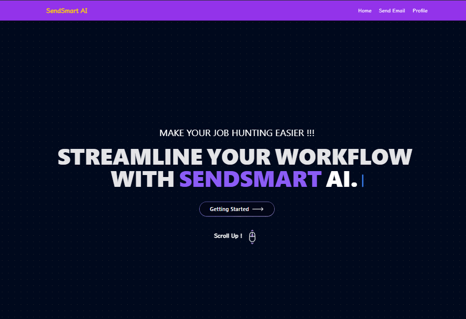
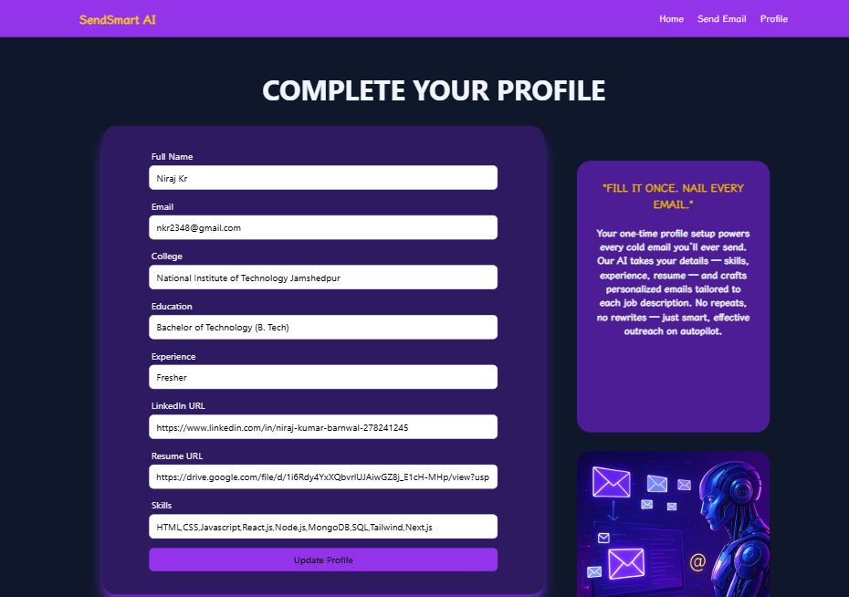
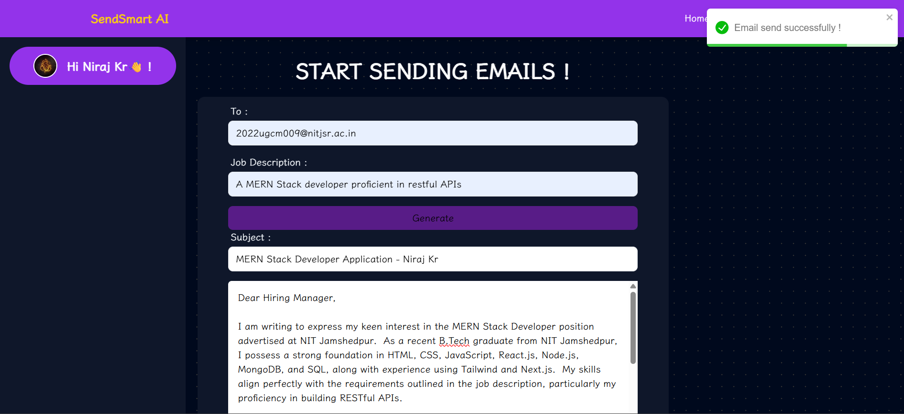

# SendSmart AI 🚀

[](https://gen-ai-cold-email-frontend.vercel.app)
> ⚠️ **Note:** The backend is hosted on a free Render server, so the **first request may take 20–30 seconds** (cold start). Please wait patiently when visiting the site for the first time.

An AI-powered web app that **generates and directly sends personalized cold emails to recruiters** using the user’s Gmail account. Built with the **MERN stack**, integrated with **Gemini AI** for content generation and **Google OAuth2 + Gmail API** for secure email delivery.

---

## 📸 Screenshots

### 🔹 Home / Dashboard


### 🔹 Profile Complete 


### 🔹 Generated Email Preview


---

## ✨ Features

- 🔑 **Google OAuth Authentication** – Secure login with Gmail.  
- 📧 **Personalized AI Emails** – Uses stored user profile (skills, college, resume, LinkedIn) to generate tailored job outreach emails.  
- 🚀 **Direct Sending** – Sends emails from the user’s own Gmail account via OAuth2.  
- 🎨 **Modern UI** – React + Tailwind for a clean, responsive interface.  
- ⚡ **Session Persistence** – Secure session management with cookies & MongoDB store.  
- 🌍 **Deployed Full Stack** – Frontend on **Vercel**, Backend on **Render**.  

---

## 🛠️ Tech Stack

**Frontend:** React (Vite), Redux, TailwindCSS  
**Backend:** Node.js, Express.js, MongoDB, Passport.js, Google APIs  
**AI:** Google Gemini API (Generative AI)  
**Auth:** OAuth2 (Google Sign-In + Gmail API)  
**Deployment:** Vercel (Frontend), Render (Backend)  

---

## ⚙️ Setup Instructions

### 1. Clone the repository
```bash
git clone https://github.com/your-username/sendsmart-ai.git
cd sendsmart-ai
